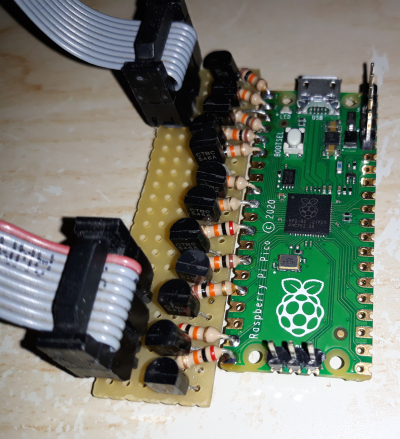
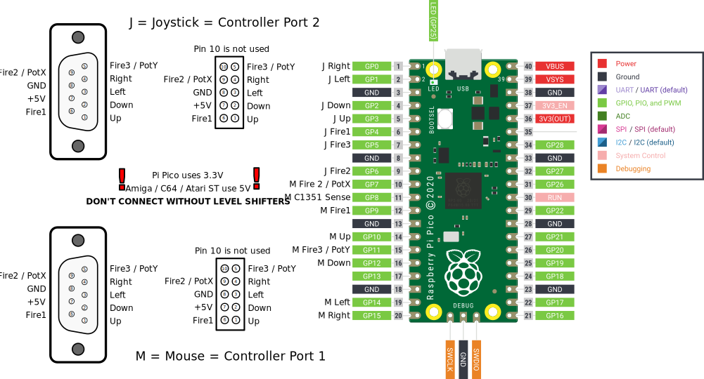
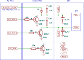
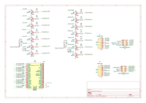

# How to construct on a perfboard

Here an example, how it could be build using BC547 transistors and 10k resistors.

## Overview

Use the photos as guidance.

It is encouraged to use a 2x5 pinheader instead of soldering the female d-sub connector to the board. It has a smaller footprint and ensures that both connectors will find their counterpart on the home computer as the distance will differ between the systems.

Especially with the Atari ST, there is not much room under the keyboard.

## Simplified schematic

Reduced to the essentials...

## Schematic

The whole circuit

